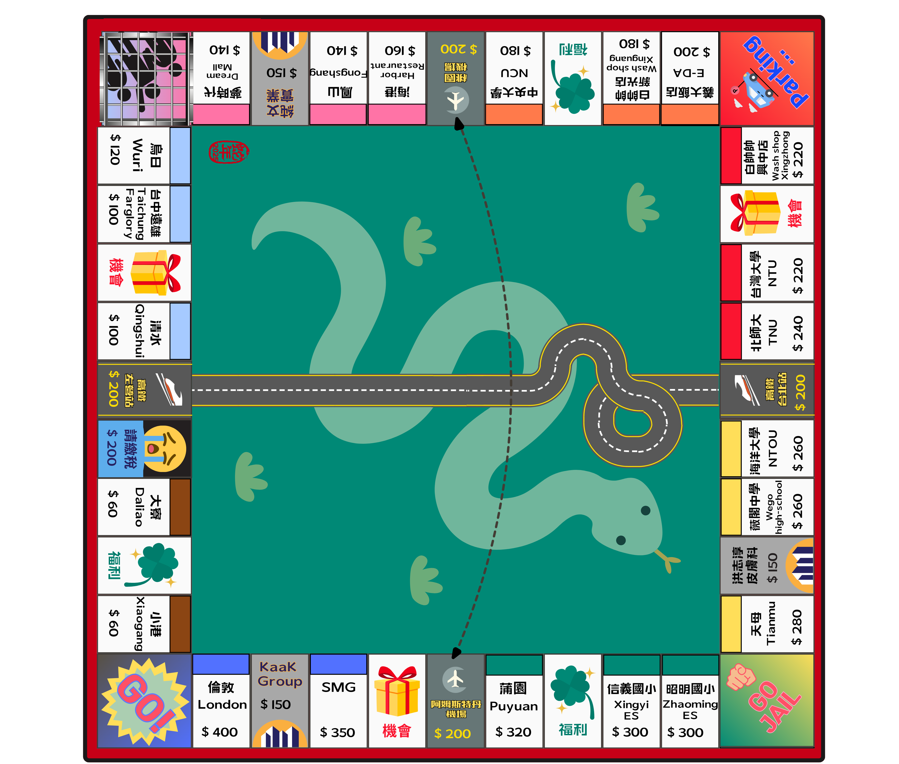

# 大富翁卡片系統 (MonopolyCards)

- 本專案示範使用 **PyQt5** + **FlowLayout** + **QScrollArea** 製作類似大富翁的卡片系統。
- This project is for the Wang family's 2025 Chinese New Year annual game.


## 功能
- 可以拖曳卡片到不同的 Group 區域。
- 抽「福利卡」、抽「機會卡」、抽「謎題」。
- 點兩下卡片可放大顯示，可切換抵押與解除抵押。
- `FlowLayout` 能讓卡片自動換行。
- 支援「監獄卡」的使用示範。
### 未來功能開發
- 無需實體棋盤及骰子等等，可直接遊玩
- 線上連線

## 目錄結構
- `data_source.py`：卡片文字內容、謎題資料
- `models.py`：`Card` 類別與顏色設定
- `widgets.py`：定義 `CardWidget`、`AreaWidget`、卡片繪製函式等
- `dialogs.py`：對話框，如放大卡片、謎題等
- `main_window.py`：`MainWindow` 主視窗，統整 UI 與抽卡功能
- `entrypoint.py`：程式執行進入點（`python entrypoint.py`）
- `requirements.txt`：相依套件（PyQt5 版本等）

## 安裝與執行
```bash
# 安裝相依套件
pip install -r requirements.txt

# 執行程式
python entrypoint.py
